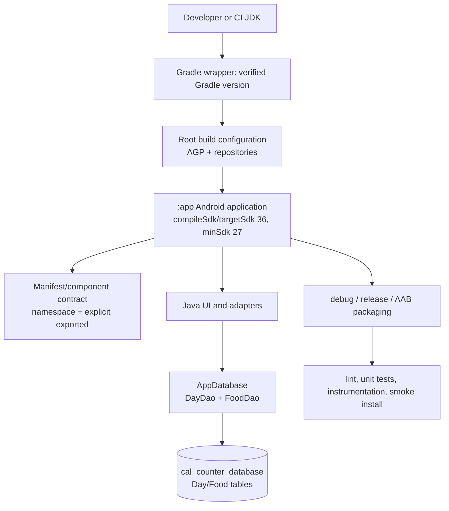

# Technical Design: Android Version Upgrade

**Feature:** `android-version-upgrade`  
**Status:** Design grounded in the user-approved requirements scope  
**Target:** Android 16 / API 36 (`compileSdk 36`, `targetSdk 36`)  
**Minimum supported API:** 27 (unchanged)  
**Repository:** `IngridMorstrad/CalCounter`

> `requirements.md` was not present in the inspected repository. This document therefore preserves the approved decisions supplied for this continuation—API 36, compile/target 36, and min SDK 27—instead of recreating a requirements document. Items marked **Unknown / discovery required** must be confirmed during implementation before source changes are committed.

## Overview

CalCounter is a single-module Java Android application using Room, AppCompat, platform `Fragment`/`Preference` APIs, MPAndroidChart, and a small SQLite database. The upgrade is a compatibility and build-system migration, not a product redesign: the application ID, minimum API, calorie-tracking behavior, settings, chart behavior, and persisted user data must remain compatible.

The target architecture retains one `:app` module and Java sources. The build will move from the 2020-era Android Gradle Plugin (AGP) 4.1.1 / Gradle 6.5 combination to a currently supported AGP/Gradle/JDK combination that is explicitly verified against API 36 as of **2026-08-05**. The exact versions are intentionally not invented in this design: the implementation must select a release pair from the official AGP release notes and compatibility matrix at that date, then pin that pair in the wrapper and build files.

### Goals

- Build and package the existing app with `compileSdk 36` and `targetSdk 36`.
- Preserve `applicationId com.ashwinmenon.www.calcounter` and `minSdk 27`.
- Remove JCenter dependence and make dependency resolution reproducible from supported repositories.
- Make the manifest valid for modern Android, including explicit exported state for activities.
- Preserve Room database contents, schema semantics, settings, and user-visible calorie/chart behavior.
- Keep Java as the implementation language and Java 8 bytecode/source compatibility unless a verified toolchain requires a narrowly scoped change.
- Establish repeatable local and CI build/test commands because the repository currently has no visible CI workflow.

### Non-goals

- Rewriting the UI, changing the calorie model, changing the application ID, or changing the minimum supported API.
- Adding Kotlin merely because a newer Android toolchain supports it.
- Enabling release shrinking or changing signing/distribution policy as part of the initial upgrade.
- Fixing unrelated product defects unless the defect blocks API 36 compatibility or data-preservation validation.

### Current-to-target summary

| Area | Current repository state | Target design |
|---|---|---|
| Modules | One `:app` module | Retain one `:app` module |
| Language | Java; Java 8 compile options | Retain Java; compile/source target remains Java 8 unless the selected AGP requires a documented adjustment |
| Build | AGP 4.1.1, Gradle wrapper 6.5, root Java/Lombok plugins | Verified supported AGP/Gradle pair; remove obsolete root Java and Gradle Lombok plugins unless discovery proves they are needed |
| SDK | Compile/target 30, min 27, explicit Build Tools 29.0.2 | Compile/target 36, min 27; let the selected AGP select Build Tools unless a pin is required |
| Repositories | `google()`, `jcenter()`, JitPack | `google()`, `mavenCentral()`, and JitPack only if MPAndroidChart still requires it; no `jcenter()` |
| Namespace | Manifest `package` only | `android { namespace "com.ashwinmenon.www.calcounter" }`; retain application ID separately |
| Manifest | Launcher lacks `exported`; fragment classes declared as activities; stale parent metadata | Explicit exported state; manifest only actual Android components; remove or correct stale metadata |
| ABI | Manual splits include obsolete `armeabi`, `mips`, and `mips64`; no universal APK | Prefer App Bundle/default packaging and no manual split block; if APK splits are required, use only ABIs supported by verified native dependencies |
| Database | Room 2.0.0, schema version 1, no exported schema or migrations | Upgrade Room as a single aligned dependency set; preserve database name/schema and add migration/schema validation before changing schema version |
| CI | No visible workflows | Add a verified build/lint/test workflow in implementation; commands are specified below |

## Architecture

### Target architecture boundaries

The upgrade keeps the existing runtime responsibilities but makes their compatibility boundaries explicit:

1. **Build boundary** — root/settings Gradle configuration selects repositories and plugins; `:app` owns Android SDK, variants, dependencies, and Java compile options.
2. **Component boundary** — the manifest declares only concrete activities and the launcher contract. Fragments remain instantiated by activities and are not manifest activities.
3. **UI compatibility boundary** — existing Main, food, settings, and chart flows remain behaviorally equivalent. Deprecated platform APIs may be migrated to their AndroidX equivalents as a narrowly scoped compatibility change because the app already uses AppCompat; the migration must not alter navigation or preference keys.
4. **Persistence boundary** — `AppDatabase` continues to expose `DayDao` and `FoodDao`, keeps the database file name `cal_counter_database`, and preserves the `day`/`food` schema and foreign-key relationship. Database access remains off the main thread, but implementation may replace ad-hoc `Thread` creation with a single application executor only when ordering and results are verified.
5. **Release boundary** — debug and release variants use the same application ID and data model. Release shrinking remains off for the first green upgrade build; R8 is a separate hardening decision.



### Migration sequencing

The implementation should proceed in gates so a toolchain failure is not mixed with a data or UI regression:

1. **Inventory gate:** confirm all source classes, manifest components, local JARs, transitive dependencies, signing inputs, and existing user-data fixtures. Confirm whether `SettingsActivity` exists outside the inspected tree and whether the manifest's fragment entries are ever launched externally.
2. **Repository/toolchain gate:** select and pin the verified AGP/Gradle/JDK combination; remove JCenter; resolve dependencies without cached artifacts.
3. **SDK/namespace gate:** set compile/target 36, keep min 27 and application ID, add namespace, remove obsolete explicit Build Tools pin, and make manifest exported/component changes.
4. **Source compatibility gate:** compile and lint. Apply only required source changes, prioritizing AndroidX fragment/preferences migration if platform APIs or selected dependencies make it necessary.
5. **Persistence gate:** validate Room-generated code and an existing version-1 database fixture. Do not increment the database version unless an actual schema change is introduced.
6. **Behavior gate:** exercise add/delete/display/settings/chart flows on API 27 and API 36 emulators or devices, then build debug and release artifacts.
7. **Release gate:** run release smoke tests and produce an App Bundle. Keep the old branch/artifacts available until upgrade and rollback evidence is recorded.

## Components and Interfaces

### Build configuration components

| File | Planned change | Compatibility contract |
|---|---|---|
| `build.gradle` | Replace AGP 4.1.1 with the exact verified stable version; replace `jcenter()` with `mavenCentral()`; remove root `id 'java'` and `io.franzbecker.gradle-lombok` if no root Java source requires them; retain Groovy DSL unless migration is separately approved | The root build must resolve from supported repositories and must not require JCenter-only artifacts |
| `settings.gradle` | Add `pluginManagement`/`dependencyResolutionManagement` repositories if required by the selected AGP; continue including only `:app` | Plugin and library repositories are centrally controlled; no accidental repository fallback |
| `gradle/wrapper/gradle-wrapper.properties` | Replace Gradle 6.5 with the Gradle version required by the selected AGP; add the distribution checksum when available | Wrapper version is the exact version tested in local and CI builds |
| `gradle.properties` | Keep AndroidX/Jetifier settings while dependencies are checked; update JVM args only if CI memory requires it; remove obsolete JVM flags if uncommented later | No undocumented global behavior switches; Jetifier can be removed only after all dependencies are confirmed AndroidX-compatible |
| `app/build.gradle` | Set `compileSdk 36`, `targetSdk 36`, keep `minSdk 27`, add `namespace`, remove `buildToolsVersion '29.0.2'` unless required, modernize variant/dependency syntax, and remove obsolete ABI splits | Application ID and variant names remain stable; generated APK/AAB is installable on API 27 and API 36 |
| `app/proguard-rules.pro` | Review only for warnings introduced by dependency updates; do not enable shrinking in the initial migration | Release behavior remains equivalent while the toolchain migration is isolated |

### Toolchain compatibility decision

The build must use the **latest stable AGP release that the official Android release notes and the selected Gradle compatibility table verify for API 36 on 2026-08-05**, not an assumed version copied from a blog or a cached local installation. The exact selection is an implementation input, represented here as:

- `AGP_VERSION = <exact stable version verified on 2026-08-05>`
- `GRADLE_VERSION = <exact version required by AGP_VERSION>`
- `BUILD_JDK = <exact supported JDK required by AGP_VERSION>`
- `KOTLIN_VERSION = none` for this Java-only project unless a dependency or source migration explicitly introduces Kotlin

This is a deliberate non-invention rule: do not state that AGP 8.x, AGP 9.x, or any particular patch is supported unless the official release notes available on the implementation date say so. AGP release notes are the authority for AGP-specific Gradle/JDK requirements; Gradle's compatibility matrix is the authority for whether the chosen Gradle daemon can run on the selected JDK. The Android 16 SDK setup documentation is the authority for installing platform 36 and the latest verified 36.x Build Tools.

**Verification procedure before pinning versions:**

1. Read the official [Android Gradle Plugin release notes](https://developer.android.com/build/releases/gradle-plugin) and identify stable releases available on 2026-08-05 that support the required Android 16/API 36 toolchain.
2. For each candidate, read its release-specific compatibility table and record its required Gradle and JDK ranges. Reject a candidate if the wrapper/JDK pair is not explicitly supported.
3. Cross-check the selected Gradle version against the [Gradle compatibility matrix](https://docs.gradle.org/current/userguide/compatibility.html). The matrix currently documents daemon JVM support independently from Java toolchain compilation support; do not confuse the two.
4. Install `platforms;android-36` and the latest Build Tools 36.x recommended by the [Android 16 SDK setup guide](https://developer.android.com/about/versions/16/setup-sdk). Avoid a hard-coded `buildToolsVersion` when the selected AGP can select it safely.
5. Run `./gradlew --version`, record the actual Gradle/JVM versions, and run a dependency-resolution build with an empty or isolated Gradle cache. The build must pass with `--refresh-dependencies` so success does not depend on JCenter-era cached artifacts.
6. If a candidate requires Kotlin only for an introduced Kotlin source/plugin, use the official [Kotlin Gradle project compatibility guidance](https://kotlinlang.org/docs/gradle-configure-project.html) and the Android [Kotlin/AGP support guidance](https://developer.android.com/build/kotlin-support). For this project, the preferred decision is to introduce no Kotlin plugin and no Kotlin source.

The current Gradle 6.5 wrapper and AGP 4.1.1 are not candidates for the target build; they predate API 36 and modern JDK requirements. The build JDK may be newer than the Java bytecode target: retain Java 8 source/target compatibility while running Gradle on the JDK required by the selected AGP.

### Dependency and repository migration

Replace the root `jcenter()` declarations with `mavenCentral()` and retain `google()` for AndroidX/Google artifacts. Retain `https://jitpack.io` only if the verified MPAndroidChart artifact still resolves there and no supported Maven Central coordinate is selected. JitPack must be scoped as a deliberate exception rather than a general fallback.

The [Gradle JCenter shutdown guidance](https://blog.gradle.org/portal-jcenter-impact) is the rationale for removing JCenter even if a local build currently succeeds. Resolution must be checked with a cold/isolated cache and dependency insight so a transitive JCenter-only artifact is not hidden.

All dependency families must be upgraded as compatible sets, with exact versions selected and recorded during implementation:

- **AndroidX AppCompat:** replace `1.0.0` with a stable release compatible with the selected AGP/API 36 baseline.
- **Material Components:** replace `1.0.0` with a stable release compatible with the chosen AppCompat line and current theme resources.
- **Room:** replace all `2.0.0` runtime/compiler/RxJava2/Guava/testing artifacts with one verified, aligned Room version. Do not mix versions. Confirm whether the RxJava2 and Guava modules are actually used before retaining them; removing unused modules is safe only after dependency/source inspection.
- **Lombok:** retain annotation processing only if it remains useful. Prefer `compileOnly` plus `annotationProcessor` rather than shipping Lombok at runtime; update from `1.18.12` only to a version verified with the selected JDK/AGP and confirm Room sees generated accessors/constructors.
- **Commons IO:** change `api` to `implementation` because this is an application module with no published consumer API, and update from `2.6` only after verifying call sites and Maven Central resolution.
- **MPAndroidChart:** retain `v3.1.0` unless a tested replacement is approved; validate its JitPack artifact and release/R8 behavior. Do not assume an unverified newer version exists.
- **JUnit/Room test helpers:** update test dependencies as a compatible set and add actual tests; the existing `ApplicationTest` is a legacy shell rather than meaningful coverage.

Dependency locking or a generated dependency verification file is recommended after the first successful resolution, but its exact format must follow the selected Gradle version. No dependency should be silently supplied by an IDE cache.

### Java, Kotlin, and Android build configuration

- Keep `sourceCompatibility` and `targetCompatibility` at `JavaVersion.VERSION_1_8` for behavior and bytecode compatibility unless the selected AGP explicitly requires a higher compile target. If raised, document why and validate API 27 execution.
- Run Gradle with the verified AGP-required JDK; do not use the local `.idea` JDK 1.8 setting as the authoritative CI toolchain.
- Do not add Kotlin, `kotlin-android`, Kotlin coroutines, or Kotlin DSL solely as part of this upgrade. If Kotlin becomes necessary later, select the Kotlin Gradle Plugin using its compatibility table and isolate that decision from the SDK upgrade.
- Preserve AndroidX/Jetifier while dependency resolution is being migrated. Remove Jetifier only after all direct and transitive libraries are confirmed AndroidX-native and a clean build proves it is unnecessary.
- Prefer the modern `compileSdk`/`targetSdk` DSL supported by the selected AGP, but do not combine syntax changes with unrelated module restructuring.

### Namespace and manifest component contract

Add `namespace "com.ashwinmenon.www.calcounter"` to the `android` block and retain `applicationId "com.ashwinmenon.www.calcounter"`. The namespace controls generated `R`/`BuildConfig` package resolution; the application ID must remain unchanged for upgrades to existing installs. After all source/resource references are checked, remove the manifest-level `package` attribute if the selected AGP flags it as redundant or invalid for the project style.

The manifest must be corrected as follows:

- Set `android:exported="true"` on the launcher `MainActivity`, because it has the `MAIN`/`LAUNCHER` intent filter.
- Set `android:exported="false"` on every internal activity that has no external intent contract, unless discovery proves another component must launch it.
- Confirm every `<activity>` refers to a concrete `Activity` subclass. The inspected source contains `FoodFragment`, `ChartFragment`, and `SettingsFragment`, but no visible `SettingsActivity`; the current manifest declares `FoodFragment`, `ChartFragment`, and `SettingsActivity` as activities. This is an **Unknown / discovery required** item. The target manifest should remove fragment declarations and stale activity declarations if those components are only used as fragments. If settings or food is intended to be a standalone activity, add/retain a real activity wrapper only as an explicitly approved source change.
- Replace the self-referential `SettingsActivity` parent metadata with the actual parent only if a real settings activity exists. Otherwise remove the stale declaration and legacy `android.support.PARENT_ACTIVITY` metadata.
- Preserve the launcher label, icon, theme, backup policy, and application ID unless API 36 testing demonstrates a specific compatibility issue.

The existing code uses platform `android.app.Fragment` and `android.preference.PreferenceFragment` while the activity extends AppCompat. The preferred source-compatibility path is to migrate these to `androidx.fragment.app.Fragment`/`FragmentManager` and `androidx.preference.PreferenceFragmentCompat` only if the selected dependency set and compile/lint gate require it. Preference keys (`days_to_query`, `days_to_average`) and navigation behavior must not change. If the deprecated platform APIs still compile and runtime tests show no target-36 issue, the migration may be kept as a separate follow-up to minimize risk; the manifest correction remains mandatory.

### ABI packaging decision

Remove the current manual ABI split list. It includes obsolete `armeabi`, `mips`, and `mips64` values and is not justified by the visible Java-only dependency set. Prefer a Play App Bundle (`bundleRelease`) and let the Android build system generate device-specific delivery. For direct APK distribution, use a single universal debug/release APK unless implementation discovery finds a native dependency requiring splits.

Before deleting the split block, inspect `app/libs`, all resolved dependencies, and generated APK contents for `.so` files. If native libraries are found and splits are needed, retain only ABIs actually supplied and supported by those libraries—at minimum do not reintroduce `armeabi`, `mips`, or `mips64`. A universal debug artifact should remain available for emulator/manual validation.

### Debug and release variants

| Variant | Initial policy | Validation |
|---|---|---|
| `debug` | Debuggable; no minification; same application ID unless a local-only suffix is explicitly needed | `assembleDebug`, install on API 27/API 36, exercise database/UI flows |
| `release` | Keep `minifyEnabled false` for the first migration; preserve existing ProGuard file; use the normal signing path outside the repository | `assembleRelease` and `bundleRelease`, install the signed/unsigned test artifact as permitted, smoke test existing data |
| Future hardened release | Consider R8/optimized resource shrinking only after a separate test baseline | Add keep rules for Room/MPAndroidChart only if evidence requires them; do not combine with initial SDK migration |

The current version code/name (`1`/`1.0`) and signing ownership are **Unknown / discovery required**. Do not change versioning or commit secrets as part of this design.

## Data Models

### Existing persistent contract

The Room database is `cal_counter_database`, schema version `1`, with these entities:

| Entity/table | Key and fields | Required preservation |
|---|---|---|
| `Day` / `day` | Primary key `dayId`; string `date` | Keep every existing row and primary key; do not regenerate rows over existing data |
| `Food` / `food` | Auto-generated `food_id`; `name`, `calories`, `proteins`, `dayId` | Keep IDs, values, and day associations; preserve the foreign key to `Day` with cascade delete semantics |

`FoodDao` provides all-food, by-day, and by-name reads plus insert/delete/update. `DayDao` provides all-day and ID-based reads plus insert/delete/update. The database filename and application ID are part of the upgrade contract because changing either would make existing user data appear to disappear.

### Room upgrade strategy

1. Export the current schema before changing Room dependencies. Because the repository has no visible schema directory, the implementation must generate a version-1 schema artifact from the old build or construct a fixture from a real pre-upgrade database.
2. Upgrade Room runtime, compiler, optional modules, and testing artifact together. Run annotation processing and inspect the generated schema.
3. If entity columns, affinity, indices, foreign keys, or table names remain identical, keep `@Database(version = 1)`; dependency upgrades alone do not justify a version bump.
4. If a required source/API change alters the schema, increment the version and add a real `Migration(old, new)`. Never use destructive migration for this feature. Test every existing row and foreign-key relationship after migration.
5. Keep the database singleton scoped to the application context. Avoid changing database name or initialization timing while validating the SDK upgrade.
6. Replace raw background threads only with an equivalent lifecycle-safe executor/DAO pattern if needed. Writes must remain serialized enough to preserve the current insert/update ordering; no UI callback may read partially loaded `foodsForAllDays`.

### Behavior preservation matrix

| User behavior | Data/logic contract | Validation |
|---|---|---|
| Launch and view days | Existing days remain visible; existing DB rows are not duplicated | Fresh install and upgrade-install smoke tests |
| Add food | Name, calories, proteins, and selected day are stored and displayed | Add a representative food on an existing day; query DB and relaunch |
| Delete food | Preserve the currently intended delete behavior; determine during discovery whether deletion is UI-only or persisted because current code removes from the adapter but does not call `FoodDao.delete` | Explicit regression test and defect decision before implementation |
| Calorie/protein totals | Existing integer sums and ratio formatting remain equivalent | Unit tests for zero protein, normal values, and multi-day totals |
| Settings | Preference keys/defaults remain `days_to_query=7` and `days_to_average=8` | Upgrade install, change values, relaunch, verify summaries and calculations |
| Chart | Existing averaging window and calorie trend remain equivalent | API 27/API 36 chart smoke test with known data |
| Existing database | `cal_counter_database` opens without loss or destructive reset | Room migration/integrity test using a pre-upgrade fixture |

The code contains several discovery risks that must not be mistaken for upgrade requirements: static mutable lists, a fixed historical start date (`13/10/2020`), raw threads, possible division by zero for invalid settings, and asynchronous initialization races. The implementation should document any behavior fix separately and keep the first migration focused.

## Correctness Properties

These are migration verification properties for the finite Android configuration, persistence, manifest, and artifact contracts. They are checked with deterministic configuration checks, representative fixtures, and API-level smoke tests; they do not require arbitrary 100-case property-test obligations.

### Property 1: Target configuration and approved-value preservation

For every target build, the evaluated Android configuration SHALL use `compileSdk 36`, `targetSdk 36`, and the existing `minSdk 27`; it SHALL preserve `applicationId com.ashwinmenon.www.calcounter` and namespace `com.ashwinmenon.www.calcounter`. Variant names, versioning, signing configuration, and other unrelated values SHALL remain unchanged unless an approved migration decision records the change.

**Validates: Requirements 1.1, 1.2, 1.3, 1.4, 1.5, 2.1, 2.2, 2.3, 2.4, 2.5, 4.1**

**Verification:** Run `./gradlew --no-daemon :app:properties :app:assembleDebug :app:assembleRelease` and assert the evaluated configuration/build report contains the required SDK, namespace, and application ID values. Compare the pre- and post-migration variant/signing/version configuration snapshot and require an explicit approval for every unrelated difference.

### Property 2: Dependency and toolchain resolution determinism

For the same Gradle wrapper, JDK, source tree, dependency lock or verification inputs, and repository configuration, repeated clean dependency resolutions SHALL select the same dependency graph and toolchain versions.

**Validates: Requirements 3.1, 3.2, 3.3, 3.4, 3.5, 6.1, 6.2**

**Verification:** In two isolated Gradle user-home directories, run `./gradlew --no-daemon --refresh-dependencies clean :app:dependencies` and `./gradlew --no-daemon --refresh-dependencies dependencyInsight --dependency androidx.room --configuration debugRuntimeClasspath`; record `./gradlew --version` for each run and compare normalized dependency reports and toolchain-version output. Any difference is a release-blocking reproducibility failure.

### Property 3: Room data preservation across the upgrade

For every representative baseline `cal_counter_database` fixture, opening it with the upgraded app SHALL preserve database identity, all `Day` and `Food` rows, primary keys, values, relationships, and foreign-key behavior when the schema is unchanged. If the schema changes, the tested explicit migration SHALL preserve the same contract without destructive reset.

**Validates: Requirements 4.2, 4.3, 4.4, 4.5, 8.5**

**Verification:** Run the Room fixture/migration tests with `./gradlew --no-daemon :app:testDebugUnitTest :app:connectedDebugAndroidTest`. Before and after opening the fixture, compare the database filename/identity and a row-level inventory of IDs, values, day associations, and relationships; assert that the tested path uses no destructive fallback. Execute the exact old-to-new migration path for each supported prior schema version when a version bump is approved.

### Property 4: Manifest component contract

For every built variant, the merged manifest SHALL contain exactly the approved component set, exactly one intended launcher declaration for `MainActivity`, and an explicit `android:exported` value for every declared activity. Fragment classes and stale/nonexistent activity declarations SHALL not appear as activities unless discovery explicitly approves a real activity wrapper.

**Validates: Requirements 5.4, 5.5**

**Verification:** Run `./gradlew --no-daemon :app:processDebugMainManifest :app:processReleaseMainManifest` and inspect the merged manifests or run `apkanalyzer manifest print app/build/outputs/apk/debug/app-debug.apk`. Compare component names, intent filters, and exported values with the approved manifest fixture; fail if the launcher count or any declaration differs.

### Property 5: Artifact and workflow equivalence on supported APIs

For every debug and release artifact accepted for distribution, the artifact SHALL install and the core calorie-tracking workflows SHALL remain equivalent on API 27 and API 36, aside from platform differences documented by the migration. Core workflows include launch, existing-data display, add/read food, totals/protein calculations, settings persistence, chart display, navigation, and relaunch/process recreation.

**Validates: Requirements 4.2, 4.3, 4.4, 4.5, 7.1, 7.2, 7.3, 7.4, 7.5**

**Verification:** Run `./gradlew --no-daemon :app:assembleDebug :app:assembleRelease :app:bundleRelease`, install the resulting APKs on API 27 and API 36 test devices, and run the same instrumentation/smoke suite with `./gradlew --no-daemon :app:connectedDebugAndroidTest` (plus the release install smoke check where signing permits). Compare recorded workflow outcomes and database state against the pre-migration baseline, allowing only differences documented in the compatibility findings.

## Error Handling

### Build and dependency errors

- Fail the build when any dependency resolves only through JCenter or an unapproved repository. Use dependency insight and a clean cache to identify the source.
- Treat AGP/Gradle/JDK mismatch errors as toolchain-selection failures; do not work around them by suppressing warnings or reverting to JCenter.
- Keep `--stacktrace` and `--warning-mode all` output in CI artifacts for the migration branch.
- If a library is unavailable from supported repositories, stop and choose a maintained replacement or a verified coordinate; do not silently vendor an unknown binary.

### Manifest and runtime errors

- Manifest merger errors must be resolved by correcting component declarations and exported state, not by suppressing merger checks.
- A missing activity class or fragment-as-activity declaration is a release blocker because it can fail on navigation even if compilation succeeds.
- API 36 behavior changes that affect edge-to-edge/system bars, back navigation, permissions, or notifications must be recorded as targeted compatibility findings. Do not add broad compatibility flags without explaining their effect on API 27.

### Persistence errors

- Opening an existing database with a schema mismatch, failed migration, or foreign-key violation is a release blocker.
- Never catch a migration exception and delete/recreate the database.
- If a migration is required but cannot be proven, keep the database version unchanged and stop the release gate rather than shipping data loss.
- Capture a backup/fixture of a representative pre-upgrade database before testing. For debug-only local validation, use an approved `run-as`/ADB workflow; do not expose user data in logs or commit database files containing personal data.

### Data and UI lifecycle errors

- Database work must not run on the main thread, but asynchronous work must also not update detached views or stale static collections.
- Invalid numeric preference values and empty/invalid food inputs are **Unknown / discovery required** behavior. Preserve existing behavior initially unless the approved scope includes validation changes; add a regression test for the observed behavior.
- Do not log food names or full database contents in release builds. Existing verbose logs of food data should be removed or disabled as part of the implementation hardening if they expose user-entered data.

## Testing Strategy

Property-based testing is **not required for this feature**. The dominant acceptance surface is build configuration, manifest wiring, UI rendering/interactions, Android framework behavior, and Room/external file persistence. These are better covered by schema checks, representative unit tests, integration tests, device smoke tests, and build/lint gates than by generating 100 arbitrary Android environments. Pure calculation helpers can receive ordinary unit tests; a future extraction of pure transformation logic may independently justify property tests.

### Test layers

1. **Configuration/smoke checks**
   - Confirm `namespace`, `applicationId`, `compileSdk 36`, `targetSdk 36`, and `minSdk 27` from the evaluated Gradle model or build output.
   - Confirm no `jcenter()` remains in build/settings files and dependency resolution succeeds with a cold cache.
   - Confirm the manifest has exactly one launcher activity and explicit exported state for every declared activity.
   - Confirm obsolete ABIs are absent from packaging configuration and inspect generated artifacts for expected native libraries.

2. **Unit tests**
   - `Food.getRatio()` for zero protein and normal values.
   - Calorie/protein sum and averaging behavior for empty, one-day, and multi-day datasets.
   - Preference parsing and bounds once the implementation decides how invalid values are handled.
   - Room entity/DAO behavior with an in-memory database where practical.

3. **Room migration/integration tests**
   - Open a pre-upgrade version-1 fixture with the target Room library.
   - Verify `Day` and `Food` row counts, primary keys, field values, day associations, and foreign-key behavior.
   - Verify adding a food, reading by day/name, updating, deleting, closing, and reopening the database.
   - If schema version remains 1, explicitly prove that no migration or destructive fallback occurs. If a version changes, run the exact migration path from every supported prior version.

4. **Instrumentation/UI tests**
   - Fresh install launch and upgrade install over a populated database.
   - Main day list, selecting a day, adding food, returning, and relaunching.
   - Settings values survive process death and continue to control totals/chart averaging.
   - Chart renders with no data, partial data, and enough data for the configured averaging window.
   - Back/up navigation and activity recreation after rotation or process recreation where supported.
   - Run representative tests on API 27 and API 36; add an intermediate API only if a failure indicates an API-specific regression.

5. **Static/build validation**
   - `lintDebug` with new warnings reviewed rather than globally suppressed.
   - `testDebugUnitTest` and `connectedDebugAndroidTest` (or the project’s available connected-test task).
   - `assembleDebug`, `assembleRelease`, and `bundleRelease`.
   - Verify release manifest merging, resource linking, and installability.

### Repeatable commands

The following commands are the intended local/CI contract after the wrapper and toolchain are pinned. They are not expected to work on the current Gradle 6.5 baseline:

```text
./gradlew --version
./gradlew --no-daemon --stacktrace --warning-mode all clean
./gradlew --no-daemon --stacktrace --warning-mode all :app:lintDebug :app:testDebugUnitTest
./gradlew --no-daemon --stacktrace --warning-mode all :app:assembleDebug :app:assembleRelease :app:bundleRelease
./gradlew --no-daemon --stacktrace --warning-mode all :app:connectedDebugAndroidTest
./gradlew --no-daemon --refresh-dependencies :app:dependencies
./gradlew --no-daemon dependencyInsight --dependency androidx.room --configuration debugRuntimeClasspath
```

`connectedDebugAndroidTest` requires an available API 27/API 36 emulator or device and should not be run as a watch or long-running process. CI should separate the fast build/lint/unit-test job from the emulator job when startup time is material.

### CI design (currently absent)

Add a GitHub Actions workflow only during implementation after exact action versions and the selected JDK/Android SDK packages are verified for 2026-08-05. The workflow should:

- check out the repository;
- install the selected JDK and Android SDK platform 36/required Build Tools;
- use the committed Gradle wrapper, not a runner-global Gradle;
- run clean dependency resolution, lint, unit tests, debug/release builds, and bundle packaging;
- run instrumentation tests on a documented API 27 and API 36 matrix or a scheduled emulator job;
- upload lint/test reports and generated artifacts;
- avoid signing production artifacts or exposing secrets for pull requests.

No existing CI facts were found, so action versions, emulator image identifiers, signing configuration, and artifact retention are **Unknown / discovery required**.

## Rollback and Risk Controls

### Main risks and mitigations

| Risk | Control |
|---|---|
| AGP/Gradle/JDK mismatch | Select from official compatibility tables; pin wrapper/JDK; run clean-cache build before source migration |
| JCenter-only transitive dependency | Remove JCenter early; run with isolated cache; replace or verify every unresolved artifact |
| API 36 manifest/runtime changes | Explicit exported components; API 27/API 36 smoke tests; review target-SDK behavior changes |
| Room schema/data loss | Preserve DB name/application ID; export schema; fixture-based migration tests; never use destructive migration |
| Obsolete/native ABI failure | Remove obsolete split entries; inspect native `.so` contents; prefer AAB/default packaging |
| Deprecated platform fragments/preferences | Migrate only when required, with navigation/preference-key regression tests |
| Release-only failure after debug success | Build and smoke-test release and bundle variants before declaring completion; keep minification disabled initially |
| Existing lifecycle/data race exposed by new libraries | Keep behavior scope narrow; test process recreation and asynchronous database load; isolate fixes |

### Rollback plan

- Make the upgrade on a new branch with separate commits for toolchain, repository/dependency, manifest/SDK, source compatibility, and test/CI changes.
- Preserve the last known-good wrapper and build files until the target build passes all gates.
- Keep a pre-upgrade debug database fixture and a checksum/row-level inventory, without committing personal data.
- If a dependency or source migration fails, revert that migration commit rather than reverting the SDK target while leaving partial compatibility changes.
- Do not ship a database schema version increase until a tested forward migration exists. If a schema change is introduced, document that the old app cannot necessarily read the new schema and provide a tested release rollback policy before distribution.
- Keep the application ID and signing identity unchanged so a validated build upgrades the installed app instead of creating a second app. Version-code rollback policy must be confirmed with the release owner because stores generally do not accept a lower version code.

## Requirements-to-Design Mapping

Because the approved `requirements.md` is not present on disk, this mapping uses the confirmed requirements areas supplied for this continuation.

| Approved requirements area | Design response |
|---|---|
| Fixed Android target: API 36 | `compileSdk 36`, `targetSdk 36`; official Android 16 SDK installation and target behavior validation |
| Preserve minimum support | `minSdk 27` remains unchanged; API 27 smoke coverage |
| Modernize legacy build | Verified AGP/Gradle/JDK selection, wrapper pinning, Java 8 bytecode, no invented future version claims |
| Migrate repositories/dependencies | Remove JCenter; use Google/Maven Central and narrowly justified JitPack; align AppCompat, Material, Room, Lombok, Commons IO, chart, and test dependencies |
| Modern Android app configuration | Namespace, unchanged application ID, explicit `android:exported`, concrete activity declarations, corrected parent metadata |
| ABI handling | Remove obsolete manual ABI splits; prefer App Bundle/default packaging; verify native libraries before any remaining split decision |
| Java/Kotlin/build configuration | Remain Java-only; keep Java 8 source/target; no Kotlin plugin unless separately required and compatibility-verified |
| Release/debug behavior | Preserve debug/release variants and disable minification initially; build APK and AAB artifacts with release smoke tests |
| Calorie-tracker behavior | Preserve days, food entries, totals, ratios, settings, chart averaging, navigation, and existing application ID |
| Room/data preservation | Preserve database name/schema/entities/foreign key; export schema and validate fixture/migrations; never destructive-reset data |
| Testing and validation | Configuration checks, unit tests, Room integration/migration tests, API 27/API 36 instrumentation, lint, release/AAB builds |
| CI/build reproducibility | Add a workflow because none exists; use the wrapper, verified JDK/SDK, cold-cache resolution, and documented commands |
| Risk/rollback | Staged commits, fixture backups, no unvalidated schema bump, artifact/signing/version-code checks, branch rollback |

## Unknowns Requiring Implementation Discovery

1. Whether the repository snapshot is complete: `SettingsActivity` is not visible, while the manifest declares it; `FoodFragment` and `ChartFragment` are declared as activities even though their visible classes extend `Fragment`.
2. Whether any external launcher, deep link, shortcut, or test relies on the current manifest declarations or parent metadata.
3. Whether `app/libs` or transitive dependencies contain native libraries that require ABI splits.
4. Which exact AGP/Gradle/JDK versions are stable and mutually compatible on 2026-08-05; this must be verified from the release-specific official tables before editing files.
5. Whether the app is distributed through Google Play, direct APK, or both; this determines the release artifact and ABI packaging acceptance criteria.
6. Release signing configuration, versioning policy, minimum supported device coverage, and whether a production database backup path exists.
7. Whether the current deletion behavior is intentionally UI-only or a pre-existing persistence defect; current source removes an item from the adapter without calling `FoodDao.delete`.
8. Whether the fixed historical start date and static lists are intentional product behavior or bugs exposed by lifecycle testing.
9. Whether Java 8 bytecode is a hard compatibility requirement for downstream tooling/devices, and whether any Kotlin source is planned. No Kotlin source/plugin is currently visible.
10. Which Android Studio/SDK manager image and CI runner are approved, and whether API 27 emulator images are available for instrumentation tests.

## Research References

- [Android Gradle Plugin release notes](https://developer.android.com/build/releases/gradle-plugin) — authoritative AGP release and compatibility information.
- [Set up the Android 16 SDK](https://developer.android.com/about/versions/16/setup-sdk) — API 36 platform and Build Tools setup.
- [Google Play target API requirements](https://developer.android.com/google/play/requirements/target-sdk) — rationale for target API 36 for Play submissions.
- [Gradle compatibility matrix](https://docs.gradle.org/current/userguide/compatibility.html) — Gradle daemon JVM and Java toolchain compatibility.
- [Kotlin Gradle project configuration](https://kotlinlang.org/docs/gradle-configure-project.html) — use only if Kotlin is introduced later.
- [Android Kotlin/AGP support](https://developer.android.com/build/kotlin-support) — AGP/compiler support reference if Kotlin dependencies appear.
- [Gradle JCenter shutdown impact](https://blog.gradle.org/portal-jcenter-impact) — basis for removing `jcenter()` and testing with a clean cache.
